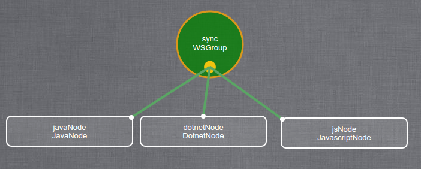

#### Purpose of this tutorial
You will not write a single line of "code" within this tutorial.
You will just use Kevoree's tools in order to run and manage a distributed system.  

  - **Kevoree Web Editor**:      Visualize, edit and deploy your model
  - **Kevoree Java Runtime**:    Runs the Java platform of your model (javaNode)
  - **Kevoree Node.js Runtime**: Runs the JavaScript platform of your model (jsNode)

The distributed system you are about to build and run is composed of:

  - **WSGroup**: to share the model between the 3 nodes  
  - **JavaNode**: to host a Ticker
      - **Ticker**: to send a random message every X seconds to ConsolePrinter
  - **JavascriptNode**: to host a ConsolePrinter
      - **ConsolePrinter**: to display the received message from Ticker to the console
  - **DotnetNode**: to also host a ConsolePrinter
  - **WSChan**: to relay the messages between the 3 components  
    This channel creates a client that connects to the specified server (in its dictionary attributes)

#### The big picture

*Graphical view of the complete system from the Kevoree Web Editor*
  


#### Create a base KevScript model

In order to use all the Kevoree tools and make some reconfigurations @Runtime,
you will start from a refined Kevscript model

```txt
add javaNode : JavaNode
add dotnetNode : DotnetNode
add jsNode : JavascriptNode
add sync : WSGroup

attach javaNode, dotnetNode, jsNode sync

set sync.master = 'node0'

network javaNode.ip.wlan PUBLIC_IP_OF_THE_JAVA_NODE_HOSTING_MACHINE
```

#### Run the Kevoree JS platform
Kevoree JS provides a command-line tool to start a Kevoree runtime easily.  
The module is named `kevoree-nodejs-runtime`, and it is available with `npm`

```sh
npm i -g kevoree-nodejs-runtime
```

> The `-g` argument tells `npm` to install the module "globally" so that you can use it as an executable just like any other commands

So now you should be able to use `kevoreejs`, which is the executable command-line client installed with `kevoree-nodejs-runtime`

```sh
╭─leiko@kevtop ~  
╰─➤  kevoreejs -v
5.1.1
```

Let's use `kevoreejs` to run the **jsNode** from your KevScript `starterModel.kevs`

```sh
kevoreejs -n jsNode --kevscript=/path/to/starterModel.kevs
```

  - **-n**: set the name of this node platform runtime
  - **--kevscript**: path to a KevScript model file to bootstrap on


### Run the Kevoree Java platform
Kevoree Java provides a **.jar** file to start a Kevoree runtime easily.  
You can download it [here](http://oss.sonatype.org/service/local/artifact/maven/redirect?r=public&g=org.kevoree.platform&a=org.kevoree.platform.standalone&v=RELEASE) or run the following command

```sh
wget "http://oss.sonatype.org/service/local/artifact/maven/redirect?r=public&g=org.kevoree.platform&a=org.kevoree.platform.standalone&v=RELEASE" -O kevoree.jar
```

Let's use this **.jar** to run the **javaNode** from your KevScript `starterModel.kevs`

```sh
java -Dnode.name=javaNode -Dnode.bootstrap=/path/to/starterModel.kevs -jar kevoree.jar
```

> N.B: if you use Windows, then you will probably have to enclose the arguments within double quotes '"'  
> `"-Dnode.name=javaNode"`

### Run the Kevoree Dotnet platform
Kevoree Dotnet provides a **.exe** file to start a Kevoree runtime easily.
It is avaible [here](https://github.com/kevoree/kevoree-dotnet-core-bootstrap/releases/latest).

Once *kevoree-core-bootstrap.zip* downloaded and extracted, you can add *kevoree-dotnet-core-bootstrap.exe* to you path.

```powershell
PS C:\Users\username\kevoree-core-bootstrap> .\kevoree-dotnet-core-bootstrap.exe --help

  -n, --node.name                  (Default: node0) Dotnet main node name

  -p, --script.path                path to a startup model (json or KevScript)

  --nuget.local.repository.path    Nuget local repository.

  --nuget.repository.url           (Default: https://packages.nuget.org/api/v2)
                                   Nuget remote repository.

  --kevoree.registry.url           (Default: http://registry.kevoree.org)
                                   Kevoree remote registry.

  --kevoree.log.level              (Default: Info) Instance log level.

  --help                           Display this help screen.

PS C:\Users\username\kevoree-core-bootstrap> .\kevoree-dotnet-core-bootstrap.exe --node.name=dotnetNode --script.path="path/to/starterModel.kevs"
```


#### Use your distributed system
Now that you have 3 Kevoree runtimes running on your machine, you can visualize them using the Kevoree Web Editor  
http://editor.kevoree.org/?host=PUBLIC_IP_OF_THE_JAVA_NODE_HOSTING_MACHINE



Click on the editor menu **KevScript**, remove the content (or append to it)

```txt
add javaNode : JavaNode
add dotnetNode : DotnetNode
add jsNode : JavascriptNode
add javaNode.ticker : Ticker
add dotnetNode.printer, jsNode.printer : ConsolePrinter
add sync : WSGroup
add chan : RemoteWSChan

attach javaNode, dotnetNode, jsNode sync

bind jsNode.printer.input chan
bind dotnetNode.printer.input chan
bind javaNode.ticker.tick chan

set sync.master = 'node0'
set chan.uuid = 'ANY_RANDOM_VALUE'
set chan.host = 'ws.kevoree.org'

network javaNode.ip.wlan PUBLIC_IP_OF_THE_JAVA_NODE_HOSTING_MACHINE
```

> Nb: you could have also done that graphically by going through **Model** > **Kevoree Registry Libraries** and merge whatever libraries you want from there.  
> And then use the drag'n'drop feature to add the needed components, and set the dictionary attributes using the form.


Now, click on the **jsNode** and **Push** your new model. You should see the adaptations taking part on both runtimes if you switch back to their console.

#### Conclusion
You have successfully built a distributed reconfigurable cross-platform system using **Kevoree** that sends messages from a Java ticker component to a JavaScript console printer component and la Dotnet console printer component, using a fragmented (Java/Js/Dotnet) channel that communicates through the use of Web Sockets.
