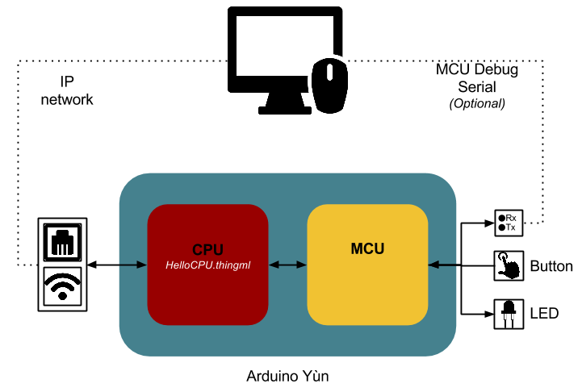

#Installation

## Installing libraries on the Yùn

- Go to the 1.HelloCPU folder

- Copy the installation files on your Yùn
```
scp -r Yun_installation_files root@ip.of.your.Yun:/root
```

- Connect to your Yun
```
ssh root@ip.of.your.Yun
```

- Change the permission or the installation script
```
chmod +x /root/Yun_installation_files/install.sh
```
- Lunch the installation script
```
cd Yun_installation_files
./install.sh
```

- Reboot your Yun's CPU by pressing on the "Yùn RST" button

> ***Note*** that if you currently have a sketch on the MCU which use the Serial1 or any Bridge library component, you might want to hold the "32u4 RST" button before pressing "Yùn RST" and release it only a dozain of second after.
Indeed, when the Yun's CPU reboot there is a moment where it ask to press any key to interrupt the boot, and writing on the Serial1 count may interrupt it.

***Info***: The script simply copies the libraries (microhttpd, websocket, and mosquitto) compiled for AR9331 in /usr/lib/ and their headers in /usr/lib/Headers. It also deactivates the bridge provided by default that prevent you from using the serial connection between CPU and MCU directly (as you will need in this tutorial). (If you want to reactivate it, just uncomment the line containing /ttyATH0 in the file /etc/inittab)


## Installing Arduino Yun Cross Compiler
- Install the cross compiler
```
docker run lyadis/arduino-yun-cross-compiler > ayxc
chmod +x ayxc
alias ayxc="/path/to/ayxc"
```
More documentation about this docker image is available on [Docker Hub](https://hub.docker.com/r/lyadis/arduino-yun-cross-compiler/)

## Run an example
The first example provided only aims at testing the toolchain ThingML compiler > cross compiler > deployment on the Yun's CPU.



- Compile the HelloCPU.thingml file
- Got to the folder generated
```
ayxc make
```
- Upload HelloCPUCfg on your Yun
- Run it
